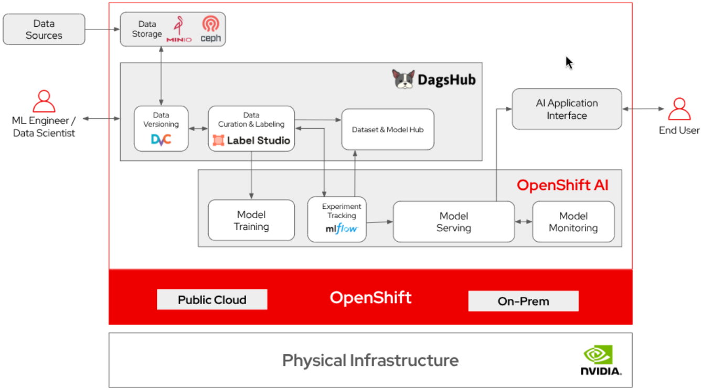

# Unify the AI development lifecycle with DagsHub and OpenShift AI

Track experiments, manage datasets, and collaborate on AI projects on a unified platform with DagsHub&reg; and Red Hat OpenShift AI&reg;.

## Table of Contents

- [Overview](#overview)
- [Architecture](#architecture)
- [Requirements](#requirements)
  - [Minimum Hardware Requirements](#minimum-hardware-requirements)
  - [Software Requirements](#software-requirements)
- [Installation](#installation)
  - [Prerequisites](#prerequisites)
  - [Installing the quickstart](#installing-the-quickstart)
  - [Removing the quickstart](#removing-the-quickstart)
- [MLflow Workspace Proxy](#mlflow-workspace-proxy)
- [LLM Tutorial Workbench](#llm-tutorial-workbench)
- [Management](#management)
  - [Check Status](#check-status)
  - [Available Commands](#available-commands)
- [Troubleshooting](#troubleshooting)
- [References](#references)
- [Tags](#tags)

## Overview

AI teams need a centralized platform to track experiments, manage dataset versions, and collaborate on model development. While cloud-based MLOps solutions exist, many organizations require their AI infrastructure to remain within their private environment to meet security, compliance, and data privacy requirements. This AI quickstart helps teams deploy DagsHub MLOps platform on OpenShift AI to track experiments, manage datasets, and collaborate on AI projects.

DagsHub provides a complete MLOps platform with experiment tracking, model registry, and data versioning capabilities that can be deployed entirely within your organization's infrastructure.

Deploying DagsHub with OpenShift AI enables teams to maintain full control over their AI workflows and data while benefiting from enterprise-grade security and scalability. This repository simplifies the deployment process with a single Makefile that automates the installation of DagsHub on your OpenShift AI cluster.

## Architecture



## Requirements

> [!IMPORTANT]  
> A license and service account from DagsHub are required for this quickstart. See the [prerequisites](#prerequisites) section below for details.

### Minimum Hardware Requirements

Your Red Hat OpenShift&reg; cluster must have sufficient resources to run DagsHub and its dependencies:

- **CPU**: 8 vCPUs (minimum 4 vCPUs)
- **Memory**: 16 GB RAM (minimum 8 GB)
- **Storage**: 100 GB persistent storage for data, experiments, and models
- **Node capacity**: At least 2 worker nodes for high availability

**Note**: These are minimum requirements for a small team (5-10 users). For production deployments with larger teams or extensive workloads, scale resources accordingly.

### Software Requirements

- **Red Hat OpenShift**: Version 4.20 or later
- **Red Hat OpenShift AI**: Version 3.4 or later
- **Command-line tools** on your local machine:
  - `oc` CLI (OpenShift command-line tool)
  - `helm` CLI - Version 3.11 or later
  - `make` - GNU Make utility
- **Cluster access**:
  - Cluster administrator privileges (ability to create namespaces, deploy workloads, and manage secrets)
  - Authenticated session to your OpenShift cluster
- **DagsHub credentials** (obtained from DagsHub.com):
  - Enterprise license key
  - GCP service account JSON file for container registry access
- **Network access**:
  - OpenShift cluster must be able to pull container images from DagsHub's GCP registry (`gcr.io` and `us-docker.pkg.dev`)
  - Ability to expose services via OpenShift routes (for HTTPS access)

## Installation

### Prerequisites

Before deploying DagsHub on your OpenShift cluster, you need to obtain a license and service account from DagsHub:

1. **Visit DagsHub.com** and contact their team to request an enterprise license and GCP service account credentials
2. **Download the service account JSON file** provided by DagsHub (e.g., `service-account.json`)
3. **Ensure you have access to your OpenShift cluster** with the required tools installed

### Installing the quickstart

1. **Log in to your OpenShift cluster** and verify admin access:
   ```bash
   # Log in to your OpenShift cluster
   oc login https://your-openshift-cluster-url:6443

   # Verify you have admin privileges
   oc auth can-i create project
   ```

   You should see `yes` as the output. If not, contact your cluster administrator.

2. **Clone this repository**:
   ```bash
   git clone https://github.com/your-org/dagshub-ai-dev-plaform-support.git
   cd dagshub-ai-dev-plaform-support
   ```

3. **Place your service account file** in the project directory:
   ```bash
   # Copy your service account JSON file to the project root
   cp /path/to/your/service-account.json ./service-account.json
   ```

4. **Run the installation command**:
   ```bash
   make install-dagshub \
     NAMESPACE=dagshub \
     SERVICE_ACCOUNT=service-account.json \
     URL=https://dagshub.yourcompany.com
   ```

   **Parameters**:
   - `NAMESPACE`: OpenShift namespace for DagsHub (default: `dagshub`)
   - `SERVICE_ACCOUNT`: Path to your GCP service account JSON file
   - `URL`: Public HTTPS URL where DagsHub will be accessible (must start with `https://` and end with `.com`)

5. **Wait for the installation to complete**. The Makefile will:
   - Create the required namespaces
   - Configure container registry secrets
   - Deploy DagsHub using Helm
   - Expose the service via an OpenShift route

6. **Access DagsHub** at the URL you specified (e.g., `https://dagshub.yourcompany.com`)

7. **Enter your license key** on first access to complete the initial setup

### Removing the quickstart

To remove DagsHub from your OpenShift cluster:

```bash
make uninstall-dagshub NAMESPACE=dagshub
```

This command will:
1. Uninstall the DagsHub Helm release
2. Prompt you to delete the container registry secrets (optional)
3. Prompt you to delete the namespace (optional)


## MLflow Workspace Proxy

Red Hat OpenShift AI (RHOAI) 3.4+ ships a built-in MLflow instance that is shared across the cluster. To isolate experiments per namespace, RHOAI requires every API request to carry an `X-MLFLOW-WORKSPACE` header identifying the caller's workspace. DagsHub's MLflow client does not add this header natively, so requests to the built-in MLflow endpoint would be rejected.

The MLflow workspace proxy solves this by sitting between DagsHub and the RHOAI MLflow service. It is a lightweight Nginx (OpenResty) sidecar deployed in the DagsHub namespace that:

1. **Injects the workspace header** every proxied request gets `X-MLFLOW-WORKSPACE` set to the DagsHub namespace, so experiments are scoped correctly.
2. **Handles authentication** the proxy attaches a bearer token from a dedicated ServiceAccount that has `mlflow-edit`, `mlflow-view`, and `mlflow-integration` RBAC roles.
3. **Strips unsupported fields** RHOAI rejects `artifact_location` on experiment creation when workspaces are enabled, so the proxy removes it from those requests.

DagsHub is then configured to use `http://mlflow-workspace-proxy.<namespace>.svc:8080` as its MLflow tracking URI instead of calling RHOAI directly.

The proxy is deployed automatically as part of `make install-dagshub`. To check its status or remove it independently:

```bash
make mlflow-status NAMESPACE=dagshub
make uninstall-mlflow NAMESPACE=dagshub
```

## LLM Tutorial Workbench

Deploy a pre-configured Jupyter workbench with the DagsHub LLM tutorial to get started with AI development on OpenShift AI:

```bash
# Deploy the LLM tutorial workbench
make deploy-workbench \
  NAMESPACE=dagshub \
  URL=https://dagshub.yourcompany.com

# Check workbench status
make workbench-status NAMESPACE=dagshub

# Remove workbench
make uninstall-workbench NAMESPACE=dagshub
```

The workbench includes:
- **hello_world_llm.ipynb**: Complete end-to-end LLM tutorial covering RAG, fine-tuning, and evaluation
- **Pre-configured environment**: Ready-to-use Jupyter environment with DagsHub integration
- **Persistent storage**: Your work is automatically saved and preserved

After deployment, access the workbench through the OpenShift AI dashboard → Data Science Projects → Your namespace → Workbench.

📖 **For detailed workbench documentation**, see [deploy/helm/workbench/README.md](deploy/helm/workbench/README.md)

## Management

### Check Status

Check that all pods are running:
```bash
make status NAMESPACE=dagshub
```

View logs from the main DagsHub pod:
```bash
make logs NAMESPACE=dagshub
```

### Available Commands

The Makefile provides the following commands:

```bash
# Installation
make install-dagshub NAMESPACE=<namespace> SERVICE_ACCOUNT=<file> URL=<url>

# Management
make status NAMESPACE=<namespace>           # Check deployment status
make logs NAMESPACE=<namespace>             # View main pod logs
make restart-main-pod NAMESPACE=<namespace> # Restart main pod

# Cleanup
make uninstall-dagshub NAMESPACE=<namespace>  # Remove DagsHub
make delete-secrets NAMESPACE=<namespace>     # Remove secrets only

# Help
make help                                     # Show all options
```

## Troubleshooting

**Pods not starting**:
```bash
oc describe pod <pod-name> -n <namespace>
oc logs <pod-name> -n <namespace>
oc get events -n <namespace> --sort-by='.lastTimestamp'
```

**License issues**: 
- Verify you have a valid enterprise license from DagsHub
- Check that the license key was entered correctly during setup

**Network connectivity**:
- Ensure cluster can reach `gcr.io` and `us-docker.pkg.dev`
- Verify service account credentials are valid

**Access issues**:
- Check that the route was created: `oc get routes -n <namespace>`
- Verify DNS resolution for your custom domain

## References
- [DagsHub documentation](#https://dagshub.com/docs/)
- [Red Hat OpenShift AI documentation](https://docs.redhat.com/en/documentation/red_hat_openshift_ai_self-managed)
- [Red Hat OpenShift documentation](https://docs.redhat.com/en/documentation/openshift_container_platform)

## Tags

* **Industry:** Cross-industry
* **Product:** Red Hat OpenShift AI
* **Use Case:** Experiment tracking, managing datasets, and collaborating on AI projects 
* **Partner**: DagsHub
